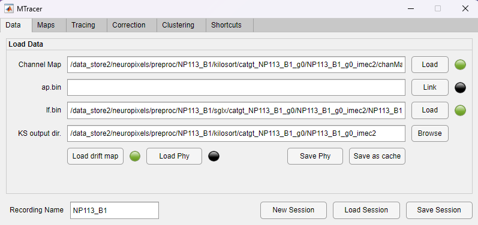
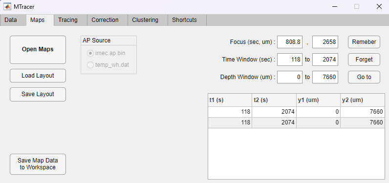
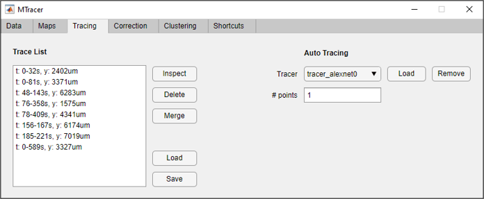
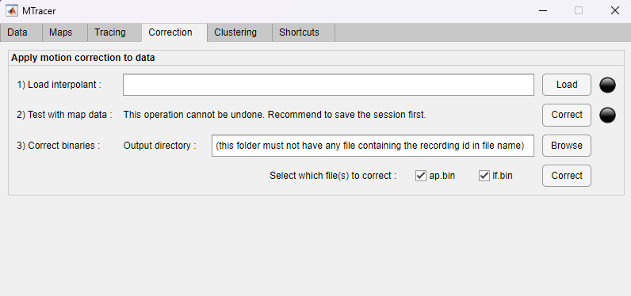
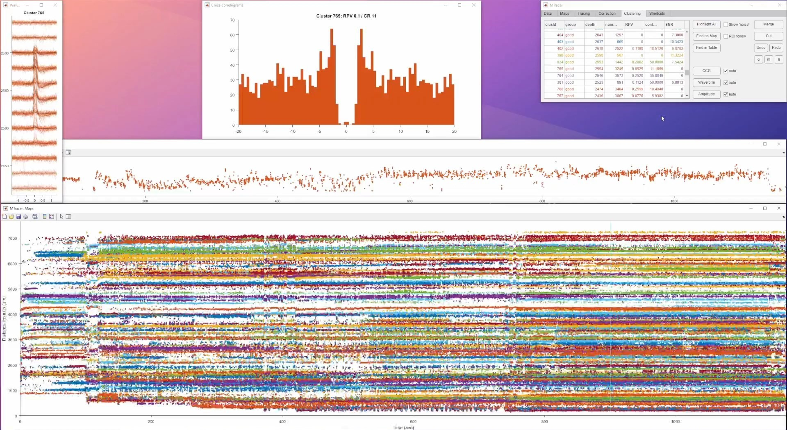

# MTracer

A MATLAB app to visualize and correct tissue motions in Neuropixels recordings, and to curate spike clusters in the context of the tissue motion.

Publications using MTracer:

- JE Chung, KK Sellers, MK Leonard, L Gwilliams, **D Xu**, ME Dougherty, V Kharazia, SL Metzger, M Welkenhuysen, B Dutta, EF Chang. High-density single-unit human cortical recordings using the Neuropixels probe. *Neuron*, 2022. ([Link](https://www.sciencedirect.com/science/article/pii/S0896627322004482))

- MK Leonard, L Gwilliams, KK Sellers, JE Chung, **D Xu**, G Mischler, N Mesgarani, M Welkenhuysen, B Dutta, EF Chang. Large-scale single-neuron speech sound encoding across the depth of human cortex. *Nature*, 2023. ([Link](https://www.nature.com/articles/s41586-023-06839-2))

- **D Xu**, JE Chung, AB Silva, SL Metzger, QR Greicius, Y Zhang, MK Leonard, EF Chang. Human precentral gyrus neurons link speech sequences from listening to speaking. *bioRxiv*, 2024. ([Link](https://www.biorxiv.org/content/10.1101/2024.12.27.630563v1))

## Installation

There are two ways to install MTracer:

**1. Add to Path (Recommended)**

1. Clone or download this repository
2. Add the repository folder to your MATLAB path
    - In MATLAB, Home -> Set Path -> Add with Subfolders -> Select the repository folder
    - Or run `addpath(genpath('path_to_mtracer'))` in the MATLAB command window
3. This will also include the three external dependencies in the `external` folder:
    - `ManyFunMatlab`
    - `neuropixel-utils`
    - `npy-matlab`

**2. App Installer**

1. Double-click the `\release\MTracer.mlappinstall` file to install it in MATLAB
2. The app will appear in the MATLAB Apps tab
3. Note that installing with the app installer will not give you access to the source code of the app

**Compatibility**

- Requires MATLAB 2021a or later
- To read Kilosort 4 results, Python must be available to MATLAB

## Run the App

**For most users**

Run "MTracer" from the MATLAB command window.  
Tip: you can save this command to the Favorites tab for quick access.

**As an object (for advanced users)**

```matlab
mtracer = MTracerVM;
```

## Maps Window

The Maps Window is the main visualization interface of MTracer, implemented as a LayeredFigure that manages multiple plot layers. Each layer can be toggled independently for different use cases:

- **Focus Layer**: Crosshair highlighting the currently selected point on the maps.
- **LFP Layer**: Displays low-passed local field potential data as a heatmap, showing the continuous voltage signals across channels over time.
- **AP Layer**: Shows action potential (spike) voltage traces around the focus when requested by pressing 'v'.
- **Drift Map Layer**: Visualizes individual spikes from Kilosort's "drift map" as dots, with their y-positions corresponding to detection locations.
- **Traces Layer**: Displays the smooth tissue motion tracking traces.
- **Trace Anchors Layer**: Displays anchor points the user created for the tissue motion tracking traces.
- **Clustering Layer**: Visualizes individual spikes as dots, colored by cluster membership.

The window supports three interaction modes:
1. **Navigation/Selection Mode**: Change the focus point or select a nearby trace.
2. **Tracing Mode**: Add anchor points to the tissue motion tracking traces.
3. **Cluster Cutting Mode**: Cut spike clusters by drawing polygons.

**Example Video 1**: Drift Map Layer + Traces Layer (click to play on YouTube)

[](https://youtu.be/kTB0YQXjERk)

**Example Video 2**: Clustering Layer (click to play on YouTube)

[](https://youtu.be/ajViOUu2O68)


## Tabs

MTracer consists of several tabs, each serving a group of functions:

### Data Tab

The Data tab allows you to load or link Neuropixels data:



**Data Loading Fields**:
- **Channel Map**: Path to the Neuropixels channel map file in .mat format
- **ap.bin**: Path to the raw AP (action potential) binary file
    - AP data will not be read immediately, but is linked or mapped to memory.
    - Snippets of AP traces can be plotted in **Maps** windows by pressing 'v' on the keyboard.
- **lf.bin**: Path to the raw LF (local field) binary file
    - LF data will be read in full and downsample to 50 Hz for plotting as a heatmap.
- **KS output dir**: Path to the Kilosort output directory
    - **Load drift map**: Import "drift map" if rez.mat is present.
    - **Load Phy**: Load Phy-compatible Kilosort output, or an available cache file.
    - **Save Phy**: Export clustering results back to Phy format.
    - **Save as cache**: Cache clustering results to a .mat file for easier reuse.

**Session Management**:
- **Recording Name**: Set name for the current recording
- **New Session**: Start a fresh session
- **Load Session**: Restore a previous session
- **Save Session**: Save current session state

### Maps Tab

The Maps tab contains the main visualization window and controls:



**Maps Window**:
- **Open Maps**: The main display showing multiple data layers. Supports pan, zoom, and various interaction modes
- **Load Layout**: Load a previously saved window layout
- **Save Layout**: Save the current window layout

**AP Source**:
- Choose between imec.ap.bin or temp_wh.dat for AP traces

**Navigation**:
- **Focus**: Showing/setting the time (in seconds) and depth (in μm) of the focus.
- **Time Window**: Showing/setting the time window (in seconds) to display.
- **Depth Window**: Showing/setting the depth window (in μm) to display.
- **Remember**: Remember the current time and depth window.
- **Forget**: Delete the selected time and depth window entry.
- **Go to**: Jump to a region of interest.

**Layer Controls**:
- Toggle visibility of different data layers:
  - Focus indicator - Press '1'
  - Drift map layer (raw spike positions) - Press '2'
  - Clustering layer (cluster-colored spikes) - Press '3'
  - AP traces layer - Press '4'
  - LFP heatmap layer - Press '5'
  - Anchor points - Press '6'
  - Interpolated traces - Press '7'

### Tracing Tab

The Tracing tab allows you to manage tissue movement tracking points:



**Trace List**:
- Displays list of traces with their timestamps and depths (e.g., "t: 0-32s, y: 2402um")

**Trace Operations**:
- **Inspect**: View details of selected trace such as a decomposition of slow drift and fast oscillations.
- **Delete**: Remove selected trace
- **Merge**: Combine multiple traces
- **Load**: Load previously saved traces
- **Save**: Save current traces as .mat files.

**Auto Tracing**:
- **Tracer**: Select tracking model.
- **# points**: Specify number of tracking points to generate

### Correction Tab

The Correction tab allows you to apply drift correction to the data:



**1) Load Interpolant**: Load a previously saved interpolant derived from traces (using an external script).

**2) Test with map data**: Apply the interpolant to data in the Maps window for a preview.

**3) Correct binaries**: Apply the interpolant to the AP/LF data and save the corrected binaries.

### Clustering Tab

The Clustering tab allows you to perform spike cluster curation:



The Clustering tab provides tools for manual curation of spike clusters:

**Cluster List**:
- Table showing cluster information
- Color-coded by cluster
- Click to select clusters for operations

**Navigation and Visuals**:
- **Highlight All**: Highlight all clusters
- **Show Noise**: Toggle visibility of noise clusters in gray
- **Find on Map**: Navigate to the location of selected clusters in the Maps window
- **Find in Table**: Selected the closest cluster to focus point in the table
- **ROI follow**: Toggle whether the ROI in Maps window follows the selected clusters
- **Recolor**: Reassign cluster colors

**Cluster Operations**:
- **Merge**: Combine selected clusters
- **Cut**: Enter polygon cutting mode to split clusters
- **g/m/n**: Label selected clusters as good/mua/noise

**Feature Windows**:
- **CCG (Cross-Correlogram)**: A grid of histograms showing the temporal relationship between spikes in different clusters.
  - Diagonal histograms show the auto-correlogram of each cluster.
  - Off-diagonal histograms show the cross-correlogram between each pair of clusters.

- **Waveform**: Display spike waveforms from selected clusters. There are two ways of selection.
  - Select from the cluster list.
  - Select from the Maps window using MATLAB's brush tool.

- **Feature-time**: Plots spike features over time. Press 'f' to cycle through the following features.
  - Amplitude
  - X-Position

### Shortcuts Tab

In this tab, you can find documentation for all the shortcuts in the app.

| Category | Key | Function |
|----------|-----|----------|
| Navigation | Click on map | Set focus |
| | ] | Zoom in time |
| | [ | Zoom out time |
| | + | Zoom in depth |
| | - | Zoom out depth |
| | o | View the whole map |
| | c | Center focus |
| | w/s/a/d | Move up/down/left/right |
| | Shift + w/s/a/d | Move faster |
| | Scroll | Move left/right |
| Plotting | 1 | Toggle focus indicator |
| | 2 | Toggle raw spikes |
| | 3 | Toggle cluster spikes |
| | 4 | Toggle AP traces |
| | 5 | Toggle LFP heatmap |
| | 6 | Toggle anchor points |
| | 7 | Toggle interpolated traces |
| | . | Increase spike marker size |
| | , | Decrease spike marker size |
| | v | Plot AP traces around focus |
| Tracing | t | Enter tracing mode |
| | esc | Exit tracing mode |
| | Left click | Add an anchor point |
| | Right click | Undo selected point |
| | Ctrl + z | Undo last point |
| | Ctrl + Shift + z | Redo |
| | q | Query the next point with auto-tracer |
| Clustering | k | Enter cluster cutting mode or confirm cut |
| | esc | Cancel and exit cluster cutting |
| | Left click | Add a polygon vertex |
| | Right click | Remove last vertex |
| | Alt + g/m/n | Label selected cluster(s) good/mua/noise |

## Support

For issues and feature requests, please use the GitHub issues page.
